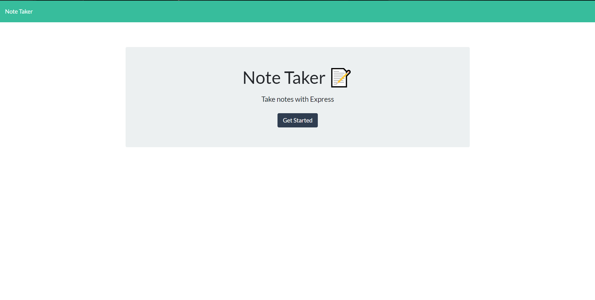
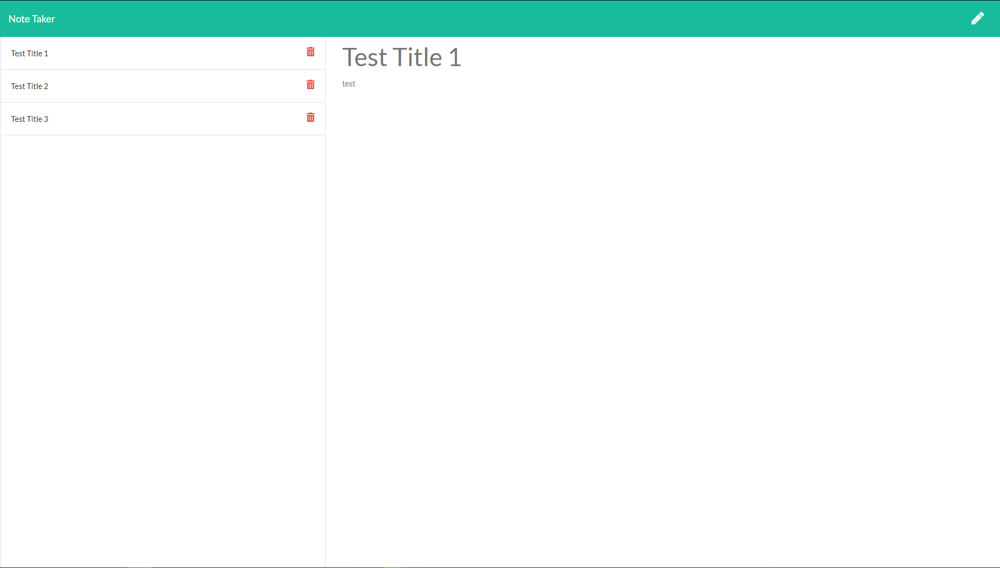

# note-take

## Description
This is a backend project demonstrating my use of express to create api routes. The project allows you to take notes, store them on a server and delete them.
Check it out here - https://gw-note-taker.herokuapp.com/

## Contact
    Contact Me With Any Questions, Comments or Anything else
https://github.com/grey-whitt

[License](./contributor_covenant.md)

Grey Whittenberger 2020
